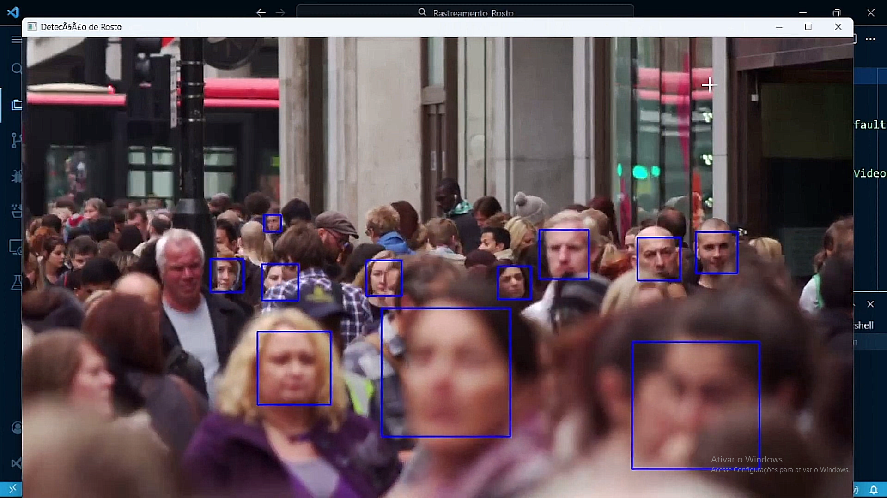

# Rastreamento de Face

Estudo de caso onde foi feito o rastreamento de rostos num vídeo utilizando a biblioteca OpenCV.
O rastreamento de rosto é a tecnologia usada para detectar e rastrear o rosto humano em imagens ou vídeos. Ele pode ser usado para uma variedade de aplicações.

